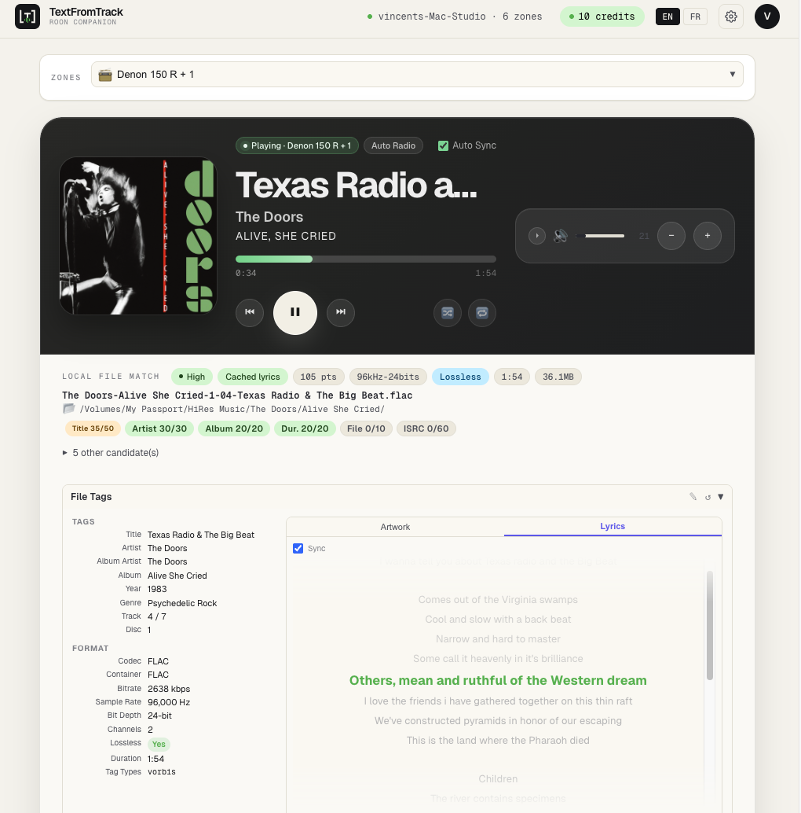

# TextFromTrack Roon Companion

[](LICENSE)

Roon doesn't expose synchronized lyrics from your local audio files. This companion fills that gap: it watches what's playing in Roon, finds the matching physical file on disk, and generates a time-synchronized `.lrc` lyric file via the [TextFromTrack](https://app.textfromtrack.com) transcription API. The `.lrc` is saved next to your audio — Roon picks it up on the next library scan.

Beyond generation, the companion lets you browse, inspect, and embed lyrics from multiple sources (TextFromTrack AI, LRCLIB, your existing file tags) from a single web UI — with karaoke-style synchronized display.

This is **not** an official Roon plugin. It is a standalone Node.js service that runs on the same machine (or local network) as your Roon Core.



---

> © 2025–2026 [Vincent Cruvellier](https://github.com/r45635) — Released under the [MIT License](LICENSE).

---

## For users

| | |
|---|---|
| 📦 **Install** | [Installation guide](docs/install.md) — Docker (recommended) or Node.js |
| 📖 **Use** | [User guide](docs/user-guide.md) — authorize Roon, scan your library, generate lyrics, embed tags |

---

## For developers

### Architecture overview

```
roon.app.textfromtrack.com/
├── src/                        Node.js / Express backend
│   ├── server.js               Express entry point
│   ├── config.js               Environment variable loader
│   ├── roon/
│   │   ├── roonClient.js       Roon API extension (discovery, pairing, zone subscription)
│   │   └── nowPlayingStore.js  In-memory now-playing state
│   ├── music/
│   │   ├── scanner.js          Recursive library scan → music-index.json
│   │   ├── matcher.js          Score-based metadata matching
│   │   ├── lyricsDetector.js   LRC sidecar + embedded lyrics detection
│   │   ├── lyricsEmbedder.js   Embed LRC into MP3/FLAC tags + .org backup orchestration
│   │   ├── flacTagger.js       Self-contained FLAC metadata editor (replaces broken metaflac-js2)
│   │   └── pathMapper.js       PATH_MAPPINGS resolution (SMB / NAS)
│   ├── textfromtrack/
│   │   ├── tftClient.js        TextFromTrack REST API client
│   │   ├── transcriptionService.js  Full orchestration (validate → submit → poll → save)
│   │   ├── jobStore.js         JSON-backed job persistence
│   │   └── webhookService.js   TFT webhook lifecycle (register, HMAC-SHA256 verify, process)
│   ├── api/
│   │   ├── routes.js           Top-level router
│   │   ├── roonRoutes.js       /api/roon/*
│   │   ├── musicRoutes.js      /api/music/*
│   │   ├── lrclibRoutes.js     /api/lrclib/*
│   │   └── textfromtrackRoutes.js  /api/tft/*
│   ├── storage/
│   │   ├── userSettings.js     Read/write user-settings.json (music roots, embed/backup defaults)
│   │   ├── music-index.json    Local music library index (runtime)
│   │   ├── user-settings.json  Persistent user preferences (runtime, created on first save)
│   │   └── jobs.json           Transcription job history (runtime)
│   └── utils/
│       ├── logger.js           Pino logger
│       ├── normalize.js        Error codes, error builder, string normalizer
│       ├── fileUtils.js        Atomic JSON read/write
│       ├── sseService.js       Server-Sent Events broadcast (real-time job status push)
│       └── lrcCache.js         LRC content cache keyed by file path and track metadata
├── client/                     Vite + React frontend
│   ├── src/
│   │   ├── App.jsx             Main layout, polling, state management
│   │   ├── i18n/               English + French translations (i18next)
│   │   └── components/         RoonStatus, NowPlaying, ZoneSelector, SearchPanel,
│                           LocalMatch, LrclibPanel, FileTagsCard, TftPanel,
│                           JobHistory, LibrarySettings, LyricsSection,
│                           SyncedLyrics, AppPrefs, FilesManagement, TftApiKey
│   └── dist/                   Built frontend (served by Express in production)
└── scripts/
    ├── scan-library.js         CLI: npm run scan
    └── test-tft-api.js         CLI: npm run test:tft
```

**Data flow for LRC generation:**

1. Roon Transport API → zone subscription → `nowPlayingStore`
2. Frontend polls `/api/roon/now-playing` → displays track
3. Frontend calls `/api/music/match-current` → `matcher.js` scores local index tracks
4. User clicks **Generate LRC** → `POST /api/tft/generate-current`
5. Backend: validate → submit to TFT → save job → start background poll
6. Frontend receives SSE event via `/api/tft/events` (or polls `/api/tft/jobs/:id`) → shows progress
7. Backend: TFT done → download LRC → save next to source file → update index
8. Frontend shows `HAS_LRC_FILE`

---

### Development setup

```bash
git clone https://github.com/r45635/roon.app.textfromtrack.com.git
cd roon.app.textfromtrack.com
npm install
cd client && npm install && cd ..
cp .env.example .env   # fill in TFT_TOKEN and MUSIC_ROOTS
```

```bash
# Terminal 1 — backend (port 3888)
npm run dev

# Terminal 2 — Vite dev server (port 5173, proxies /api to 3888)
npm run dev:client
```

```bash
# Production build
npm run build   # builds client/dist/
npm start       # Express serves API + static frontend at :3888
```

---

### Environment variables

Copy `.env.example` to `.env` and fill in the values.

| Variable | Default | Description |
|---|---|---|
| `PORT` | `3888` | HTTP port for the Express server |
| `APP_BASE_URL` | `http://localhost:3888` | Public base URL |
| `ROON_EXTENSION_ID` | `com.textfromtrack.roon.companion` | Roon extension identifier |
| `ROON_DISPLAY_NAME` | `TextFromTrack Roon Companion` | Name shown in Roon Settings |
| `ROON_DISPLAY_VERSION` | `0.1.0` | Version shown in Roon Settings |
| `ROON_PUBLISHER` | `TextFromTrack` | Publisher shown in Roon Settings |
| `ROON_CORE_HOST` | _(empty)_ | Direct Roon Core IP — skips auto-discovery (required in Docker on macOS/Windows) |
| `MUSIC_ROOTS` | _(empty)_ | Comma-separated absolute paths to scan |
| `PATH_MAPPINGS` | _(empty)_ | `from=to` pairs for SMB/NAS path translation (comma-separated) |
| `TFT_BASE_URL` | `https://app.textfromtrack.com/api/v1` | TextFromTrack API base URL |
| `TFT_TOKEN` | _(empty)_ | Your Personal Access Token |
| `TFT_DEFAULT_EXPORT_FORMAT` | `lrc` | Export format (`lrc`, `srt`, `txt`, `json`) |
| `TFT_DEFAULT_PINYIN` | `false` | Enable Pinyin romanization |
| `TFT_DEFAULT_VINTAGE` | `false` | Enable vintage transcription mode |
| `TFT_DEFAULT_AUDIO_TYPE` | `music` | Audio type hint for transcription (`music`, `speech`) |
| `TFT_DEFAULT_LANGUAGE` | _(empty)_ | Force a specific transcription language (ISO 639-1 code) |
| `WEBHOOK_BASE_URL` | _(empty)_ | Public base URL for TFT webhook delivery. When set, the app auto-registers a webhook with TFT on startup |
| `TFT_POLL_INTERVAL_MS` | `2000` | How often to poll for job status |
| `TFT_POLL_TIMEOUT_MS` | `600000` | Maximum polling duration (10 min) |
| `LOG_LEVEL` | `info` | Pino log level (`fatal`/`error`/`warn`/`info`/`debug`/`trace`) |

**Runtime user settings** (`src/storage/user-settings.json`) — editable from the UI (**Library Settings** card), override the matching `.env` values when set:

| Key | Default | Description |
|---|---|---|
| `music_roots` | `[]` | Music root paths (overrides `MUSIC_ROOTS`) |
| `path_mappings` | `[]` | Path mappings (overrides `PATH_MAPPINGS`) |
| `embed_lyrics_default` | `false` | Default state of the **embed `[LYRICS]` tag** checkbox |
| `backup_before_embed_default` | `true` | Default state of the **save `.org` backup** checkbox |
| `save_lrc_beside_source_default` | `false` | Default state of the **save LRC beside source** checkbox |
| `tft_token` | `""` | TFT Personal Access Token set via the UI (overrides `TFT_TOKEN` env var) |

**Path mappings** (SMB / NAS):

```env
# Roon sees: smb://NAS.local/Music/Artist/Track.flac
# Locally mounted at: /Volumes/Music/Artist/Track.flac
PATH_MAPPINGS=smb://NAS.local/Music=/Volumes/Music
```

---

### API reference

#### Roon endpoints

| Method | Path | Description |
|---|---|---|
| `GET` | `/api/roon/status` | Roon connection and authorization status |
| `GET` | `/api/roon/now-playing` | Current now-playing state |
| `GET` | `/api/roon/zones` | List of all Roon zones and outputs |
| `POST` | `/api/roon/active-zone` | Switch the extension's "active" zone |
| `POST` | `/api/roon/control` | Play / pause / next / previous |
| `POST` | `/api/roon/seek` | Seek the current track |
| `POST` | `/api/roon/volume` | Change output volume (absolute or relative) |
| `POST` | `/api/roon/mute` | Mute / unmute an output |
| `POST` | `/api/roon/settings` | Toggle shuffle / auto-radio / loop |
| `POST` | `/api/roon/transfer` | Transfer the queue to another zone |
| `POST` | `/api/roon/group` / `/ungroup` | Group / ungroup outputs |
| `GET` | `/api/roon/search` | Search Roon library (`?q=...&category=tracks\|albums\|artists`) |
| `POST` | `/api/roon/browse` | Low-level browse call (drill into items) |
| `POST` | `/api/roon/browse/load` | Load items from the current browse level |
| `POST` | `/api/roon/play-item` | Trigger "Play Now" on a previously-browsed item. Body: `{ item_key, hierarchy?, zone_or_output_id }` |

#### Music endpoints

| Method | Path | Description |
|---|---|---|
| `GET` | `/api/music/index/status` | Track count, last scan time, configured roots |
| `POST` | `/api/music/index/rescan` | Trigger a background library rescan |
| `GET` | `/api/music/config` | User-settings (music roots, path mappings, embed/backup defaults) |
| `POST` | `/api/music/config` | Persist user-settings |
| `GET` | `/api/music/match-current` | Match current Roon track to local file (lyrics status re-detected live) |
| `GET` | `/api/music/file-cover` | Return the embedded album art for a local file. Query: `?path=...` |
| `GET` | `/api/music/file-lyrics` | Read the embedded `LYRICS` tag and any sidecar `.lrc`. Query: `?path=...` |
| `GET` | `/api/music/file-tags` | Read all metadata tags for a local file. Query: `?path=...` |
| `POST` | `/api/music/file-lyrics` | Write (or update) the `LYRICS` tag. Body: `{ path, lrc_content, embed, backup, save_beside }` |
| `DELETE` | `/api/music/file-lyrics` | Remove the `LYRICS` tag. Query: `?path=...` |
| `GET` | `/api/music/open-folder` | Open the enclosing folder in the host OS file manager. Query: `?path=...` |

#### LRCLIB endpoints

| Method | Path | Description |
|---|---|---|
| `GET` | `/api/lrclib/lookup` | Look up lyrics from [lrclib.net](https://lrclib.net). Query: `?title=...&artist=...&album=...&duration=...&path=...` |
| `POST` | `/api/lrclib/save` | Save an LRCLIB result to disk and/or embed it. Body: `{ path, lrc_content, embed, backup, save_beside }` |

#### TextFromTrack endpoints

| Method | Path | Description |
|---|---|---|
| `GET` | `/api/tft/config` | Whether a TFT token is currently configured. Returns `{ token_configured, token_source }` — never the raw token |
| `POST` | `/api/tft/config` | Save or clear the TFT token from user settings. Body: `{ tft_token }` |
| `GET` | `/api/tft/me` | Account info (token status, email, credit balance) |
| `POST` | `/api/tft/generate-current` | Submit current track for LRC generation. Body: `{ embed, backup, backup_conflict, force }` |
| `GET` | `/api/tft/jobs` | Local job history (newest first) |
| `GET` | `/api/tft/jobs/:jobId` | Single job status |
| `GET` | `/api/tft/job-lyrics` | Fetch the LRC content for a `done` job. Query: `?job_id=...` |
| `POST` | `/api/tft/retry` | Re-submit a `done` job with no real timestamps. Body: `{ job_id }` |
| `POST` | `/api/tft/embed` | Retroactively embed the LRC of a `done` job. Body: `{ job_id, backup, backup_conflict }` |
| `POST` | `/api/tft/reveal` | Open an `.lrc` file's enclosing folder in Finder. Body: `{ path }` |
| `GET` | `/api/tft/events` | SSE stream — pushes `{ type: 'job_updated', job_id }` events to connected clients |
| `POST` | `/api/tft/webhook` | Receive TFT webhook deliveries (HMAC-SHA256 verified). Auto-registered on startup when `WEBHOOK_BASE_URL` is set |

#### Error envelope

```json
{
  "success": false,
  "error": {
    "code": "NO_CURRENT_TRACK",
    "message": "No track is currently playing in Roon.",
    "details": {}
  }
}
```

#### Error codes

Defined in [src/utils/normalize.js](src/utils/normalize.js).

| Code | HTTP | Meaning |
|---|---|---|
| `ROON_NOT_CONNECTED` | 503 | Roon Core not discovered / not reachable |
| `ROON_NOT_AUTHORIZED` | 403 | Extension not yet authorized in Roon Settings |
| `NO_CURRENT_TRACK` | 404 | No zone is playing right now |
| `NO_LOCAL_MATCH` | 404 | Matcher found no candidate file in the local index |
| `LOW_CONFIDENCE_MATCH` | 422 | Best candidate is too uncertain |
| `LYRICS_ALREADY_EXIST` | 409 | Track already has sidecar or embedded lyrics; pass `force: true` to bypass |
| `LRC_ALREADY_EXISTS` | 409 | `.lrc` already on disk at target path |
| `LRC_WRITE_FAILED` | 500 | Could not write/delete an `.lrc` sidecar |
| `LYRICS_EMBED_FAILED` | 500 | Embed step failed |
| `LYRICS_EMBED_UNSUPPORTED` | 415 | Unsupported extension (only `.mp3` / `.flac`) |
| `BACKUP_EXISTS` | 409 | `.org` backup already exists and `backup_conflict='ask'` |
| `TFT_TOKEN_MISSING` | 400 | `TFT_TOKEN` is empty in `.env` |
| `TFT_UNAUTHORIZED` | 401 | TFT rejected the token |
| `TFT_INSUFFICIENT_CREDITS` | 402 | Not enough `credit_available` |
| `TFT_RATE_LIMITED` | 429 | TFT rate limit hit |
| `TFT_TRACK_TOO_LONG` | 422 | Track exceeds TFT's duration cap |
| `TFT_UNSUPPORTED_FORMAT` | 415 | TFT does not accept the file extension |
| `TFT_EXPORT_EXPIRED` | 410 | Export endpoint no longer holds the result |
| `TFT_NOT_FOUND` | 404 | Job not found (locally or upstream) |
| `TFT_VALIDATION_ERROR` | 422 | TFT returned a validation error |
| `TFT_INTERNAL_ERROR` | 500 | TFT internal failure |
| `SOURCE_FILE_NOT_FOUND` | 404 | Matched audio file is gone from disk |
| `SOURCE_FILE_TOO_LARGE` | 413 | TFT rejected the file as too large |
| `SOURCE_FILE_UNREADABLE` | 500 | Cannot stat / read the file |
| `UNKNOWN_ERROR` | 400/500 | Catch-all |

---

### Known limitations

- **Roon does not expose the physical file path** via its Transport API. The app matches now-playing metadata (title, artist, album, duration) against a locally built index. Match confidence is shown in the UI (`high`, `medium`, `low`). Low-confidence matches are blocked from automatic submission.

- **The music index must be built manually.** Run `npm run scan` after setup and whenever new music is added.

- **Only `.mp3`, `.wav`, and `.flac` files can be submitted** to the TextFromTrack API. `.aiff`, `.aif`, and `.m4a` are indexed but cannot be uploaded.

- **Embedding `[LYRICS]` tags is supported only for MP3 and FLAC.** WAV files have no standard tag for synced lyrics — the embed step is silently skipped; the `.lrc` sidecar is still written.

- **TFT credit accounting** distinguishes `credit_balance` (total), `credit_reserved` (held by in-flight jobs), and `credit_available` (= balance − reserved). The app spends from `credit_available`.

- **Roon cloud/provider lyrics are not treated as local lyrics.** Only embedded ID3 (USLT) / FLAC (Vorbis `LYRICS`) tags and `.lrc` sidecar files are detected.

- **Job and index storage uses flat JSON files** (`jobs.json`, `music-index.json`). Sufficient for individual use; will not scale to very large libraries or concurrent access.

- **`metaflac-js2` is intentionally NOT used.** Calling `save()` after `setTag()` silently drops every other Vorbis comment AND every PICTURE block. The app ships [src/music/flacTagger.js](src/music/flacTagger.js) — a self-contained FLAC editor that preserves all blocks byte-for-byte and verifies tag count post-write.

- **No authentication.** The app should only be exposed on `localhost` or a trusted local network.

---

### Roadmap

#### v0.2 ✓
- Multi-zone support and zone selector
- Search Roon library + **Play on zone** button
- Live re-detection of `lyrics_status` on every `match-current` call

#### v0.3 ✓
- Docker container support

#### v0.4 ✓
- Write lyrics into MP3 (ID3v2 USLT) / FLAC (Vorbis comment) tags, all-other-tags-preserved
- Optional `.org` backup before any tag write, with conflict resolution UI
- Retroactive embed from job history
- TFT v1.7 integration: `timestamps=required`, `has_timestamps` from `/segments`

#### v0.5.5 ✓ — Synced lyrics display
- Sync toggle on File Tags, LRCLIB preview, and TFT preview zones
- Karaoke-style highlight + auto-scroll, locally-interpolated between Roon polls
- Unsaved-lyrics warning + 6-second discard countdown on track change

#### v0.3.1 ✓ — Electron app + infrastructure
- **Electron desktop app** — single-download installer for macOS / Windows / Linux; tray icon spawns the Express server, opens the UI in the system browser; auto-update check on startup
- TFT API token configurable from the UI — no `.env` editing required
- SSE push channel (`/api/tft/events`) for real-time job status updates without polling
- TFT webhook integration — HMAC-SHA256 verified, auto-registered on startup when `WEBHOOK_BASE_URL` is set
- LRC cache layer — avoids redundant TFT downloads for previously-processed tracks
- `save_lrc_beside_source` option configurable as a per-operation default

#### Upcoming

##### Local tag editor (mp3tag-style, lyrics-aware)
Tag inspection (all fields) and LYRICS write/delete are already done. Still pending: read/write every metadata field, bulk operations, inline LRC editor with timestamp-aware shortcuts.

##### Local player with synced lyrics verification
HTML5 `<audio>` playback streamed from the backend so users can audibly confirm the local match and visually verify lyrics sync before spending TFT credits.

##### Security & remote access
- HTTP Basic Auth / token auth when exposed outside localhost
- Background job queue with priority and retry logic
